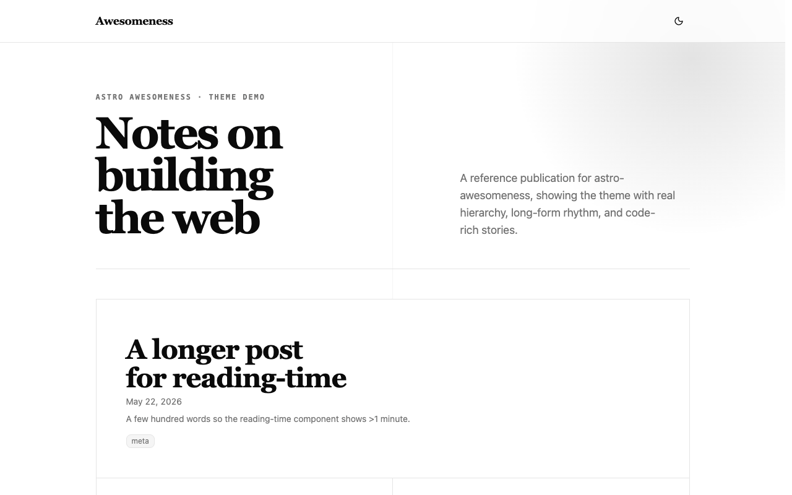
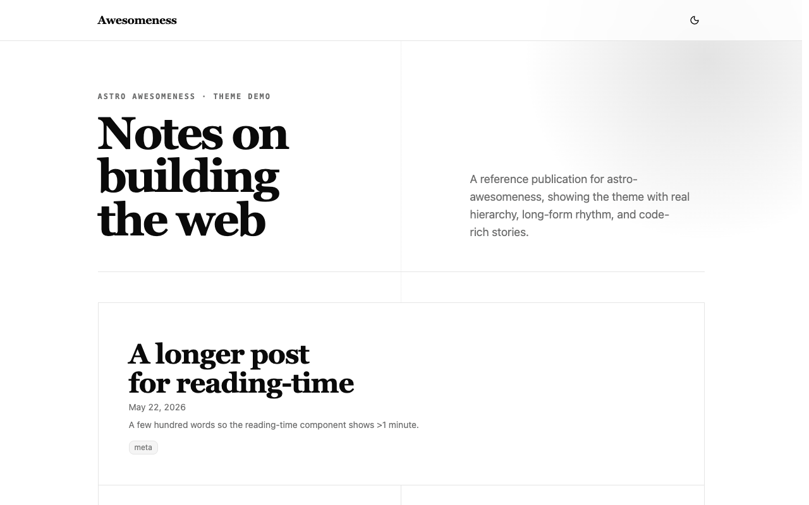
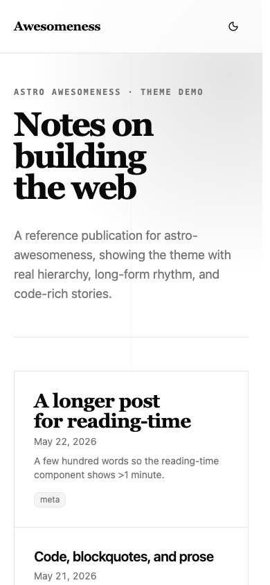
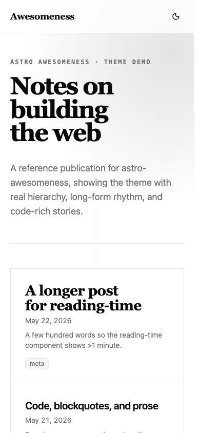

# shadcn visual comparison

Before: `766e6efcae8db4672416695bd7d342ef82529bfe` (PR merge base).

After UI source: `82977b6f953cd35969e51353fb1a49083a37c8d7`. Later commits in this PR only add review evidence.

The theme-toggle button uses the stock size, shortening the header (especially on mobile) and shifting the content up. Editorial typography, colors, and article layout are preserved.

Manually compared matching desktop (1280×800) and mobile (390×844) viewports in Chromium, light theme, reduced motion. No horizontal overflow or unexpected clipping was observed in the sampled after states. This covers the pages/states below, not every screen, authenticated flow, or dark-mode state.

## Blog index

App: `demo`. Route: `/`. Same route and state on both commits.

Desktop

| Before                             | After                            |
| ---------------------------------- | -------------------------------- |
|  |  |

Mobile

| Before                            | After                           |
| --------------------------------- | ------------------------------- |
|  |  |
